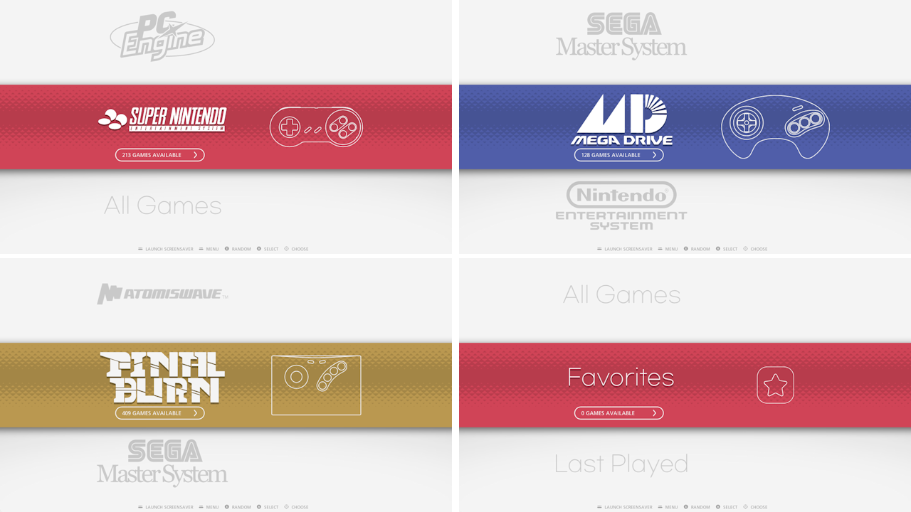

# ssimple vl - 레트로파이 에뮬레이션스테이션용 테마
'SSIMPLE VL'\
라즈겜동에서 만든 수직 디스플레이용 테마 SSIMPLE V의 가로 버전입니다.
cafe.naver.com/raspigamer

## 변경사항
- v 1.2 가로 테마 분리

## 사용법

### 옵션에서 다음과 같이 설정해주세요:
- UI 설정 > 전환 스타일: INSTANT
- UI 설정 > 회전메뉴 전환: SLIDE (또는 NONE)

**보다 정돈된 화면을 보셔면 비디오, 이미지, 섬네일, 마키등이 설정된 gamelist.xml이 준비되어 있어야합니다**

### 호환성

**16:9의 가로화면에 맞춘 테마입니다**\

### 화면비 옵션

- theme.xml : 16:9
- theme-L43.xml : 4:3
- theme-nothumb.xml : 섬네일(박스아트)없음

** 원본 'theme.xml' 파일을 'theme.xml.ori'로 이름을 변경하고 사용할 xml파일을 'theme.xml'로 이름을 바꿔주세요**\
  예 : 4:3 가로 화면비로 설정하려면 theme-L43.xml 을 theme.xml로 변경

## 라이센스

## LOGO NOTICE
* 사용된 로고 및 상표의 저작권은 해당 소유자에게 있습니다.

## Screenshots

## Video
